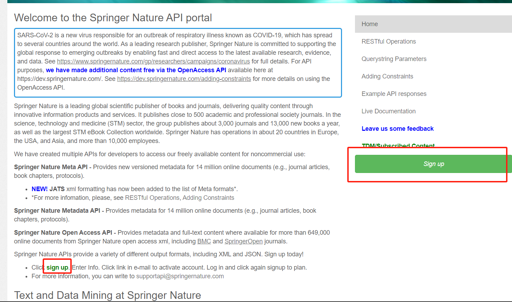

# Springer_WebCrawler

## 简介

Get information about Springer articles

[Springer API (springernature.com)](https://dev.springernature.com/)

一个简单的介绍，关于如何爬取斯普林格(Springer)上的文献。上面的网站是Springer API，可通过该网站注册并爬取文章信息。爬取其实就分三步：

1. 注册
2. 获取API key
3. 浏览文档进行爬取

网站提供三种API，原文如下：

> **Springer Metadata API** - Provides metadata for more than 13 million online documents (e.g., journal articles, book chapters, protocols).
>
> 
>
> **Springer Meta API** - Provides new versioned metadata for more than 13 million online documents (e.g., journal articles, book chapters, protocols).
>
> **Springer Open Access API** - Provides metadata and full-text content where available for more than 649,000 open access articles from [BioMed Central](http://www.biomedcentral.com/) and [SpringerOpen](http://www.springeropen.com/) journals.
>
> Springer Nature APIs provide a variety of different output formats, including XML and JSON.

## 注册以及key的获取

点击页面上的Sign up，填写相关信息即可。



注册完毕后在Applications页面能找到自己的name，点进去会有User Key。

## 文档 -- url 格式

通过向 [http://api.springernature.com](http://api.springernature.com/) 发送RESTful请求来进行爬取，其中命令应该包括*Collection* 和 *ResultFormat*。

比如：[http://api.springernature.com/ **metadata**/**pam**/doi/10.1007/s11276-008-0131-4？api_key=yourKeyHere](http://api.springernature.com/metadata/pam/doi/10.1007/s11276-008-0131-4?api_key=yourKeyHere)

在该url中，第一个粗体"metadata"表述搜索元数据存储库，第二个粗体pam表述用pam格式返回搜到的元数据。其他**Collection 和 ResultFormat**参数如下：

| **Collection**      | **Description**                                          | **ResultFormat** | ***\*Description\****                                        |
| ------------------- | -------------------------------------------------------- | ---------------- | ------------------------------------------------------------ |
| **meta versioned ** | Stores journal articles and book chapters in new version | **pam**          | Returns XML results with each record in [PRISM Aggregator Message](http://www.idealliance.org/specifications/prism-metadata-initiative/pam) format (*with some additional journal- or book-specific fields not covered by PAM at this time [e.g., openAccess]) |
|                     |                                                          | **jats** **NEW** | Returns XML results with each record in [JATS](https://jats.nlm.nih.gov/archiving) or [BITS](https://jats.nlm.nih.gov/extensions/bits) format, an industry-wide, structured standard for scientific articles and chapters (*"jats" used in path for each/both). |
|                     |                                                          | **json**         | Returns [JSON](http://www.json.org/) formatted results       |
|                     |                                                          | **jsonp**        | Returns JSON formatted results with padding                  |
| **metadata**        | Stores journal articles and book chapters                | **pam**          | Returns XML results with each record in [PRISM Aggregator Message](http://www.idealliance.org/specifications/prism-metadata-initiative/pam) format (*with some additional journal- or book-specific fields not covered by PAM at this time [e.g., openAccess]) |
|                     |                                                          | **json**         | Returns [JSON](http://www.json.org/) formatted results       |
|                     |                                                          | **jsonp**        | Returns JSON formatted results with padding                  |
| **openaccess**      | Stores open access content                               | **jats**         | Returns JATS formatted xml results ([JATS for Articles](https://jats.nlm.nih.gov/archiving/tag-library/1.1/index.html), [BITS for Chapters](https://jats.nlm.nih.gov/extensions/bits/tag-library/2.0/index.html)) |
|                     |                                                          | **json**         | Returns JSON formatted metadata results                      |
|                     |                                                          | **jsonp**        | Returns JSON formatted metadata with padding                 |

### Querystring 参数

除上面的两个参数外，还有更复杂的请求--Querystring 参数，用于执行复杂查询过滤等：

|           |                                                              |          |               |
| --------- | ------------------------------------------------------------ | -------- | ------------- |
| Parameter | Description                                                  | Required | Default value |
| q         | The query the API should perform. Supports a number of filters. | yes      |               |
| s         | Return results starting at the number specified.             | no       | 1             |
| p         | Number of results to return in this request. The maximum number of results returned in a single query is 100. *(20 in the case of Openaccess requests)* | no       | 10            |
| api_key   | The key identifying your application.                        | yes      |               |
| callback  | Name of the callback wrapper. Used only for JSONP results.   | no       |               |

简而言之，q是用来过滤查询的，比如查询特定年份，特定关键词等。s是返回结果的序号，默认为1.p是该次查询的返回结果数，最大为100.api_key是你的key。

### q 参数

q参数是最复杂的参数，可以用来过滤特定年份等，比如：

http://api.springernature.com/meta/v2/json?q=doi:10.1007/978-3-319-07410-8_4&api_key=..

此时q=doi:... 表示查询特定doi。还有很多的查询语句，详见：[施普林格 API (springernature.com)](https://dev.springernature.com/adding-constraints)

其他参数应该比较简单。

## 代码

我使用的代码如下：

```python
import requests
import pandas as pd

# 你的API密钥
api_key = 'User Key'

# 定义CSV文件名
csv_file = 'data.csv'

# 每次请求的文章数量
articles_per_request = 100

# 循环获取数据，总共获取10000篇文章
for start in range(1, 10000, articles_per_request):
    url = f'http://api.springernature.com/meta/v2/json?q=year:2020&api_key={api_key}&s={start}&p={articles_per_request}'

    response = requests.get(url)
    if response.status_code == 200:
        data = response.json()
        if 'records' in data:
            articles_data = []
            for record in data['records']:
                article_info = {
                    'Title': record.get('title', ''),
                    'Authors': "; ".join([author.get('creator', '') for author in record.get('creators', [])]),
                    'Abstract': record.get('abstract', ''),
                    'Publication Date': record.get('publicationDate', ''),
                    'Keywords/Tags': "; ".join(record.get('keyword', [])),
                    'Citations': record.get('citations', ''),
                    'Journal Reference': record.get('publicationName', ''),
                    'DOI': record.get('doi', ''),
                    'PDF URL': next((url['value'] for url in record.get('url', []) if url.get('format') == 'pdf'), ''),
                    'Web URL': next((url['value'] for url in record.get('url', []) if url.get('format') == 'html'), ''),
                    'Affiliations': "; ".join([affiliation for affiliation in record.get('affiliations', [])]),
                    'Page Numbers': f"{record.get('startingPage', '')}--{record.get('endingPage', '')}",
                    # 'Subject Classification': "; ".join([subject.get('term', '') for subject in record.get('subjects', [])]),
                    'Download Count': record.get('downloadCount', '')
                }
                articles_data.append(article_info)

            # 使用Pandas创建DataFrame
            df = pd.DataFrame(articles_data)

            # 以追加模式保存到CSV文件
            df.to_csv(csv_file, mode='a', index=False, header=not start > 1, encoding='utf-8-sig')

            print(f"Saved articles from start index {start}")
    else:
        print(f'Error: {response.status_code}')
        break

print("Article data saved to articles_data.csv")

```

可以看到，我使用的url是：http://api.springernature.com/meta/v2/json?q=year:2020&api_key={api_key}&s={start}&p={articles_per_request}'

表示搜索2020年的paper，从第s个开始返回，每次返回100个(articles_per_request)。
